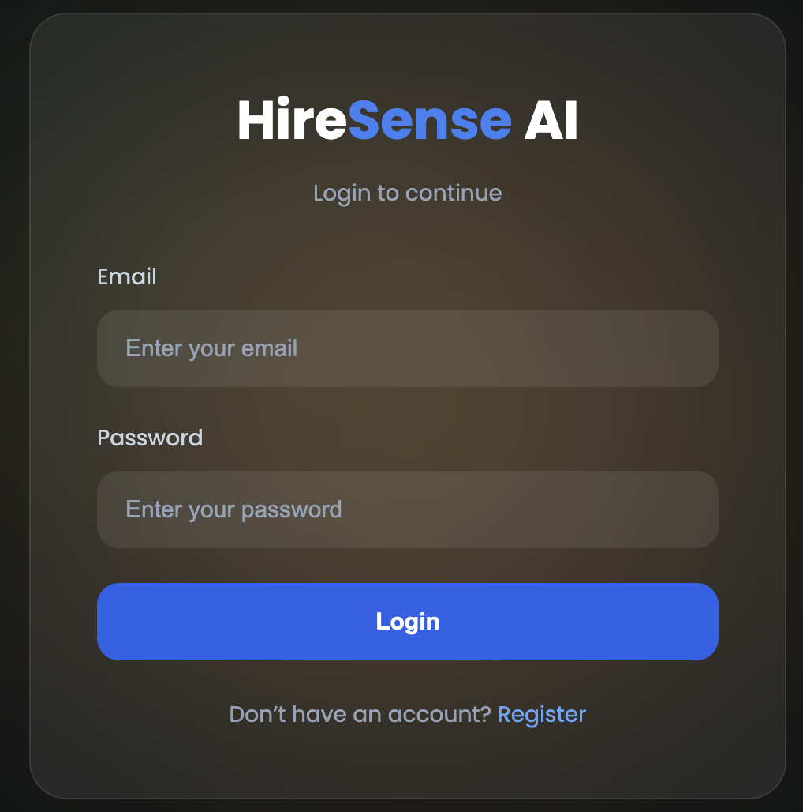
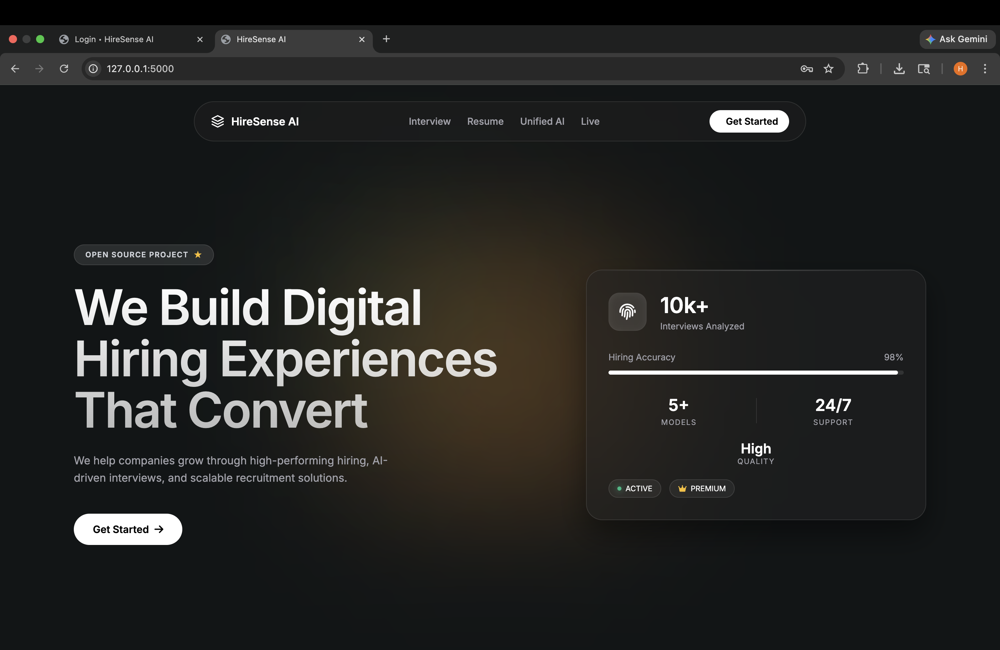
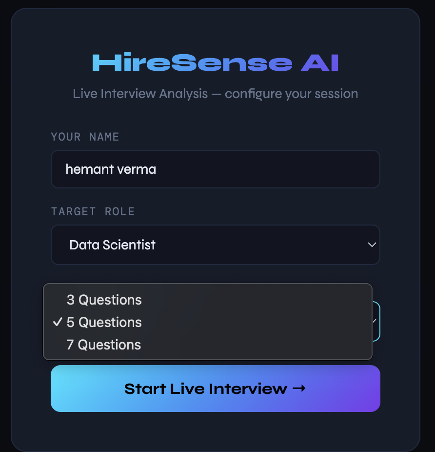
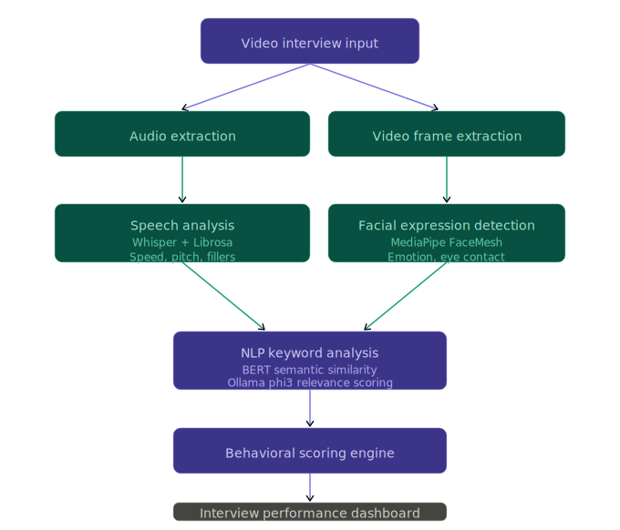

# HireSense AI

AI-powered smart hiring and live interview analysis platform developed using Flask, Python, Machine Learning, and Computer Vision.

---

# Overview

HireSense AI is an intelligent recruitment assistance platform designed to improve the hiring process using AI-based resume analysis, interview monitoring, facial analysis, and candidate evaluation systems.

The system helps recruiters analyze candidates more efficiently by combining resume screening, speech analysis, live interview monitoring, and AI-generated hiring recommendations into a single platform.

---

# Features

## Resume Analysis

* Upload candidate resumes
* Extract skills and experience
* Analyze resume quality
* Generate recruiter insights

## Live Interview System

* Real-time interview interface
* Webcam-based monitoring
* AI-powered interview workflow

## Facial Analysis

* Emotion detection
* Confidence tracking
* Eye contact analysis
* Facial alignment monitoring

## Speech & Answer Analysis

* Speech transcription
* Answer quality evaluation
* Communication analysis
* AI-generated feedback

## Hiring Recommendation System

* Candidate scoring
* Strength and weakness analysis
* Recruiter recommendation generation

## Dashboards

* Recruiter dashboard
* Candidate dashboard
* Resume analysis dashboard

---

# Tech Stack

## Frontend

* HTML5
* CSS3
* JavaScript

## Backend

* Python
* Flask

## AI / ML Libraries

* OpenCV
* SpeechRecognition
* NLP
* Machine Learning
* Facial Analysis Models

---

# Project Structure

```bash id="6pyn0i"
hiresense-ai/
│
├── app.py
├── live_interview_routes.py
├── requirements.txt
├── README.md
│
├── templates/
│   ├── login.html
│   ├── register.html
│   ├── dashboard.html
│   ├── live_interview.html
│   ├── recruiter_dashboard.html
│   ├── candidate_dashboard.html
│   └── full_analysis.html
│
├── static/
│   └── css/
│       └── global.css
│
├── modules/
│   ├── facial_analysis.py
│   ├── speech_analysis.py
│   ├── resume_analysis.py
│   ├── question_generator.py
│   ├── scoring.py
│   └── hiring_recommendation.py
│
├── models/
├── data/
├── uploads/
└── resumes/
```

---

# Installation

## Clone Repository

```bash id="bn0j1t"
git clone https://github.com/kirito6205/hiresense-ai.git
cd hiresense-ai
```

## Create Virtual Environment

### Mac/Linux

```bash id="d5p4m5"
python -m venv venv
source venv/bin/activate
```

### Windows

```bash id="0xjlwm"
python -m venv venv
venv\Scripts\activate
```

## Install Dependencies

```bash id="1q1qrz"
pip install -r requirements.txt
```

---

# Run Project

```bash id="x9x23x"
python app.py
```

Open browser:

```bash id="u9z1j2"
http://127.0.0.1:5000
```

---

# Screenshots

## Login & Registration Interface



## Resume Analysis Dashboard



## Live Interview Analysis




## Project Structure in VS Code



---

# Workflow

1. User registers/login
2. Resume uploaded and analyzed
3. AI generates interview questions
4. Live interview session starts
5. Facial and speech analysis performed
6. Candidate scored automatically
7. Recruiter receives AI-generated recommendation

---

# Future Improvements

* Voice-based AI interviewer
* Cloud deployment
* Advanced analytics dashboard
* Multi-language support
* Improved NLP models
* Real-time report export

---

# Author

Hemant Verma

---

# GitHub Repository

https://github.com/kirito6205/hiresense-ai

---

# License

This project is licensed under the MIT License.
